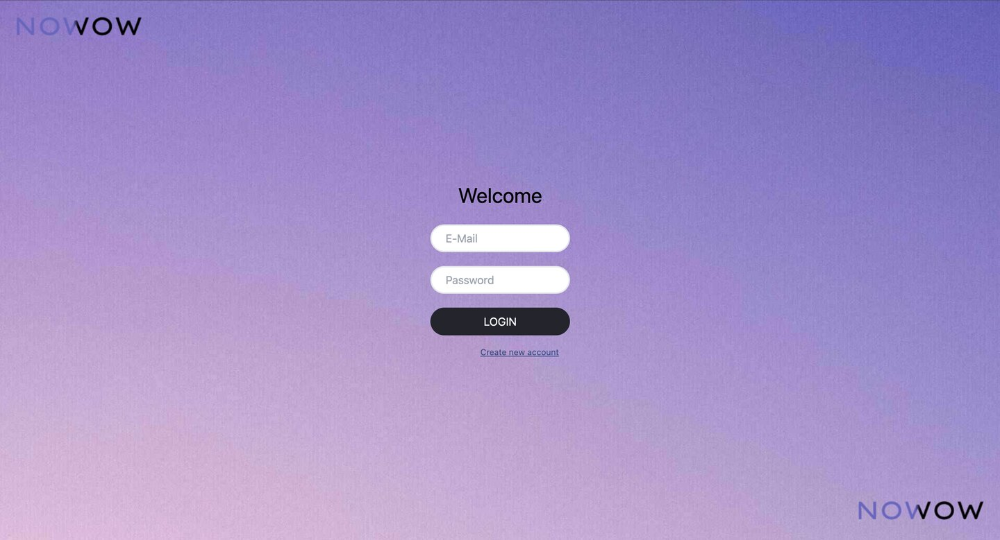

# Tailwind

Tailwind is a project where the styles were applied by using tailwind instead of the traditional hardcoded method. This project then implemented all the knowledge from js2 course from Noroff university. This is where the login page, register page and fetching the data from the API made it possible to create almost a finished project. 



Explore the website by visiting the link - [My Portfolio][(https://nikitas-portfolio.netlify.app/)](https://stately-khapse-a1bfff.netlify.app/)

## Key Features

- Register user page allows user with the noroff email to register
- Login user page checks if the user has been registered and the saves the access token when it logs you in
- Feed page displays all the posts that other users posted, allowing you to filter, search and add, delete or edit your own posts

## Built With

- Visual Studio Code

## Getting Started

### Installing:

1. Clone the repo:

```bash
git clone https://github.com/Nikita-stud/Tailwind/edit/js2
```

2. Install the dependencies:

```bash
npm install
```

### Running

To run the app, run the following commands:

```bash
npm run start
```


## Contact

You can always contact me though email or my phone number.

nikita151998@gmail.com
<br>
+4745588474

### Acknowledgments

I would like to thank my mentor Connor Obrien and Martin Krüger for helping me figure out how the methods work and on some additional thoughts and ideas regarding saving user information
